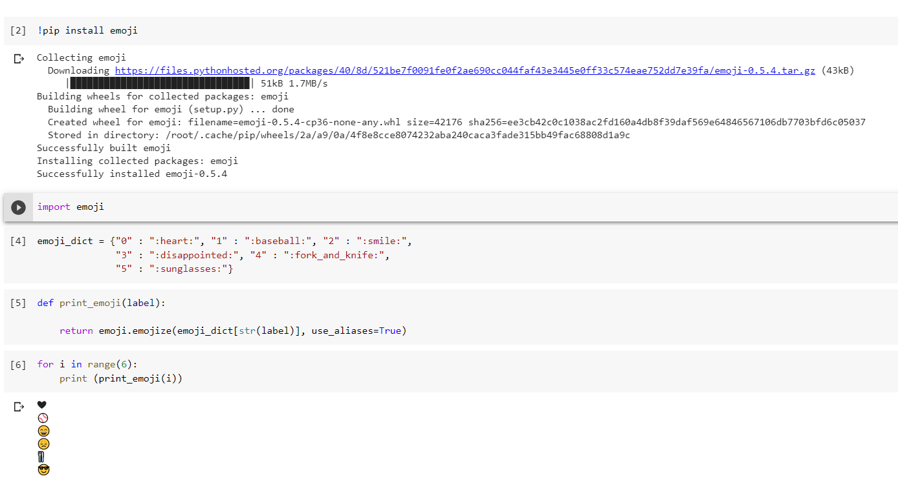

In this project we use 2 models for prediction of emojis:

## Models Used
1. Inbuit model 
2. RNN_LSTM Model

# Model 1
Inbuilt Model : : This model is present in the package 'emoji' and we use emojize function for predicting the output.

Output:

